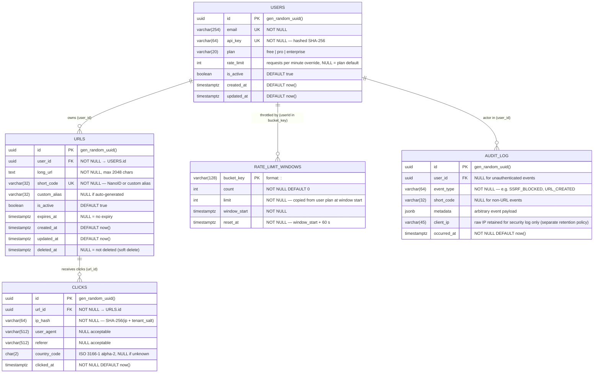

# ER Diagram — URL Shortener Data Model

Full entity-relationship diagram covering all tables, fields, types,
constraints, and relationships.

---

---

## Index Strategy

| Table    | Index Name                         | Columns                        | Type        | Purpose                                     |
|----------|------------------------------------|--------------------------------|-------------|---------------------------------------------|
| `urls`   | `idx_urls_short_code`              | `short_code`                   | B-tree UK   | O(1) redirect lookup (hot path)             |
| `urls`   | `idx_urls_user_id_created`         | `user_id, created_at DESC`     | B-tree      | List user's URLs sorted by recency          |
| `urls`   | `idx_urls_expires_at_active`       | `expires_at, is_active`        | B-tree      | TTL expiry sweeper job                      |
| `clicks` | `idx_clicks_url_id_clicked_at`     | `url_id, clicked_at DESC`      | B-tree      | Time-series stats queries per link          |
| `clicks` | `idx_clicks_clicked_at`            | `clicked_at`                   | B-tree      | Global analytics rollups (partition pruning)|
| `audit`  | `idx_audit_event_occurred`         | `event_type, occurred_at DESC` | B-tree      | Security monitoring queries                 |

## Partitioning Note

`CLICKS` SHOULD be range-partitioned by `clicked_at` (monthly) to keep
query performance predictable as the table grows into hundreds of millions
of rows. Partition pruning ensures stats queries scan only the relevant months.

## Migration Strategy

This is a greenfield schema — no existing data migration required for v1.
Future migrations MUST use sequential, non-locking operations:
`CREATE INDEX CONCURRENTLY`, `ADD COLUMN` with a default before `SET NOT NULL`.
