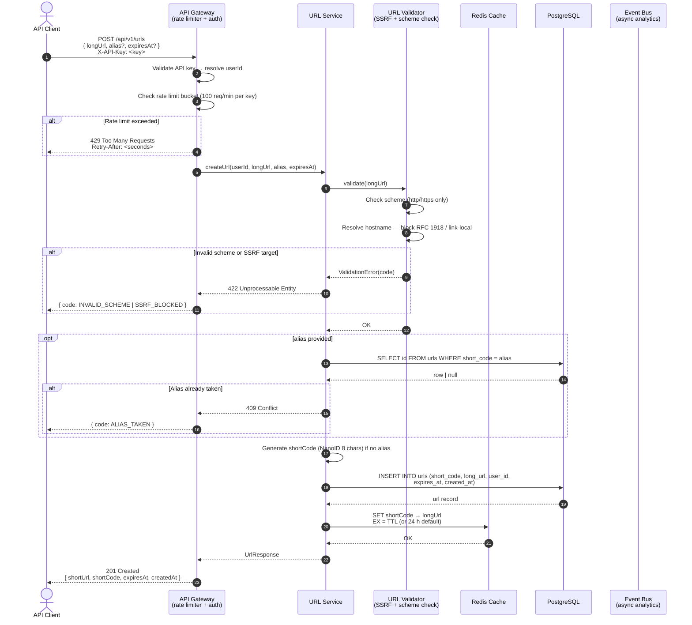
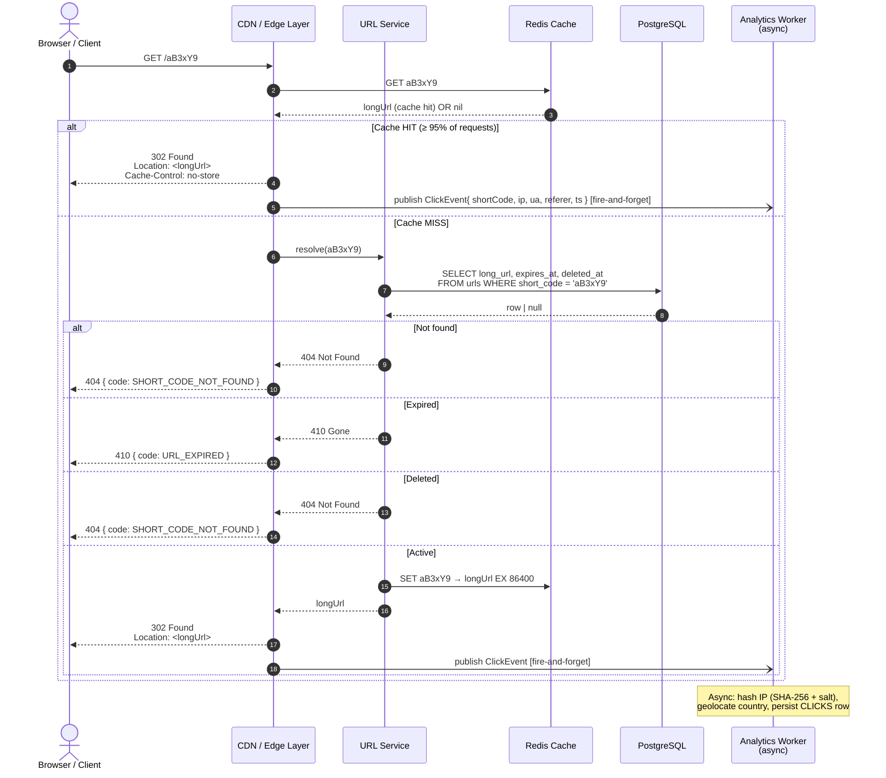
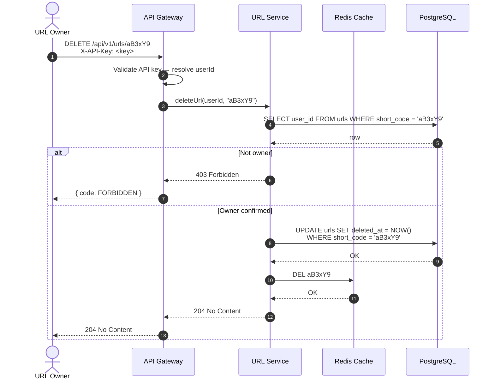

# Sequence Diagram — URL Shortening & Redirect Flow

Two primary flows are shown: **URL creation** (authenticated) and **redirect** (public).

---

## Flow 1: Create Short URL

---

## Flow 2: Redirect (Public Hot Path)

---

## Flow 3: Delete Short URL

