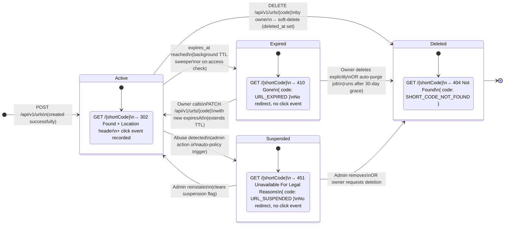

# State Diagram — URL Lifecycle

All possible states of a short URL from creation to final deletion,
including transitions, triggers, and observable HTTP behaviour at each state.

---

---

## State Transition Table

| From        | To          | Trigger                                  | Actor         | HTTP result after transition     |
|-------------|-------------|------------------------------------------|---------------|----------------------------------|
| `—`         | **Active**  | `POST /api/v1/urls` succeeds             | API client    | `302` on redirect                |
| **Active**  | **Expired** | `expires_at` timestamp passes            | System (TTL sweeper or on-access check) | `410 Gone`  |
| **Active**  | **Deleted** | `DELETE /api/v1/urls/{code}`             | Owner         | `404 Not Found`                  |
| **Active**  | **Suspended** | Abuse policy / admin flag              | Admin / system | `451 Unavailable`               |
| **Expired** | **Active**  | `PATCH /api/v1/urls/{code}` extends TTL  | Owner         | `302` resumes                    |
| **Expired** | **Deleted** | Owner explicit delete or auto-purge (30 d) | Owner / system | `404 Not Found`              |
| **Suspended** | **Active** | Admin clears suspension                 | Admin         | `302` resumes                    |
| **Suspended** | **Deleted** | Admin or owner removes                 | Admin / owner  | `404 Not Found`                 |
| **Deleted** | `—`         | Terminal state — no recovery            | —             | `404 Not Found` permanently      |

## Notes

- **Soft delete** — `deleted_at` is stamped; the row is retained for audit purposes.
  Hard purge runs after a configurable retention window (default 90 days).
- **On-access expiry check** — the redirect hot path checks `expires_at` on cache miss;
  the TTL sweeper job additionally marks bulk-expired rows hourly to keep the cache consistent.
- **Short-code reuse** — a `short_code` from a **Deleted** URL MUST NOT be reused for 30 days
  to avoid confusion for users who bookmarked the old link.
- **451 vs 404 for Suspended** — 451 (Unavailable For Legal Reasons) is used instead of 404
  to signal intentional suppression rather than an unknown code, per RFC 7725.
